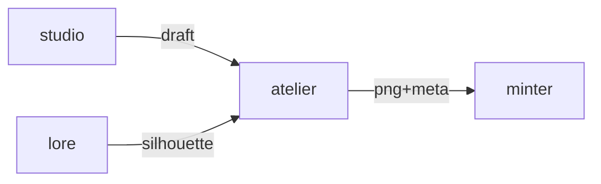

# Atelier

**Generative Asset Maker** — AI tool that generates unique 2D/3D art for new NFT traits without breaking the 210-kind canon.

Part of [ComputerPets](https://github.com/RicheyWorks/computerpets). Map: [computerpets-ecosystem](https://github.com/RicheyWorks/computerpets-ecosystem).

| | |
| --- | --- |
| Status | Design scaffold — contract frozen, implementation next |
| License | MIT |
| First pet | Still [Rui on the desktop](https://github.com/RicheyWorks/computerpets/blob/main/docs/START-HERE.md). This organ is optional. |

## The job

New hats, scars, and morphs must still read as ComputerPets. Atelier is gated by the species sheet so a red panda never grows a fish tail by accident.

The flagship overlay already puts a living sticker on the real desktop (Rui first, 210 kinds). Atelier does not replace that. It is one organ.

## Who uses it

Studio artists and operators. Players use Studio, not this GPU box.

## What it is not

Not an open prompt box. Species silhouette is a gate, not a suggestion.

## Architecture



## Stack

Python 3.12 · diffusion (SDXL / Flux) · ControlNet pose · trait JSON schema · S3-compatible asset store

GroupId / namespace: `com.enterprisepet.atelier`  
Default listen: `8094`

## Contract

### Data

`TraitSlot(id, zIndex, mask) · Candidate(png, seed, score) · CanonGate(pass|fail, reasons[])`

### Surface

- POST /v1/generate — prompt + species lock + trait slot → PNG + metadata
- POST /v1/critique — reject if it violates the species silhouette
- GET /v1/slots/{speciesId} — legal trait slots (hat, mark, color, accessory)

### Failure doctrine

Canon fail → do not upload. GPU OOM → smaller batch. NSFW filter trip → discard, log, no retry of the same seed.

## First slice

Build this and stop. Do not boil the ocean.

**Hat slot for Rui, ControlNet pose from Motion rest, canon critic that can fail the job.**

You know it works when: Panda-fish prompt fails closed. NSFW discarded, seed logged, no retry of that seed.

## Environment

`HF_TOKEN`, `ASSET_BUCKET`, `CANON_URL`

Never commit secrets. Never put Steam or chain keys in the overlay.

## Neighbors

- computerpets-bazaar (list traits)
- computerpets-minter (pin + mint)
- computerpets-studio (human in the loop)
- computerpets-lore (canon checks)

## Layout

```
computerpets-atelier/
  README.md           this file
  LICENSE             MIT
  docs/CONTRACT.md    the same contract, frozen for implementers
  src/                implementation lands here
```

## Run (Windows)

PowerShell, from this folder, after the flagship helpers (Git, Node LTS 22+, JDK 21 as needed):

```powershell
python -m venv .venv; pip install -e .; python -m atelier.cli generate --species rui --slot hat
```

You do not need this service to meet Rui. The [flagship start-here](https://github.com/RicheyWorks/computerpets/blob/main/docs/START-HERE.md) is still the first pet.

## Links

- Flagship: [RicheyWorks/computerpets](https://github.com/RicheyWorks/computerpets)
- This repo: [RicheyWorks/computerpets-atelier](https://github.com/RicheyWorks/computerpets-atelier)
- Map: [RicheyWorks/computerpets-ecosystem](https://github.com/RicheyWorks/computerpets-ecosystem)
- Contract file: [docs/CONTRACT.md](docs/CONTRACT.md)

## License

MIT. See [LICENSE](LICENSE).

---

*Two hundred ten living kinds. Keep them so a line does not go quiet.*
