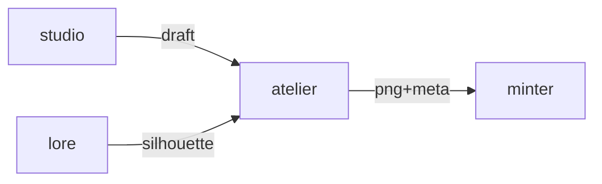

# Atelier

**Trait art that stays true to each species.**

A planned asset-generation service for artists, with species silhouette checks before artwork reaches the minting workflow.

**Stage: design scaffold.** This checkout contains a design document and a source placeholder. The experience below is planned; there is no runnable app or integrated service yet.

[Status](#status) · [Planned experience](#planned-experience) · [Contributor quickstart](#contributor-quickstart) · [Service contract](docs/CONTRACT.md) · [Ecosystem map](https://github.com/RicheyWorks/computerpets-ecosystem)

## Status

| Available today | What you can inspect |
| --- | --- |
| [Service contract](docs/CONTRACT.md) | Intended behavior, boundaries, and planned dependencies. |
| [Source placeholder](src/atelier/__init__.py) | Package metadata at version 0.0.0; no application entry point or packaging manifest is checked in. |
| [MIT license](LICENSE) | Licensing terms for the repository. |

Gameplay, endpoints, integration arrows, and failure handling on this page describe implementation targets. No build/test harness, CI workflow, or product screenshots are included in this scaffold.

## Planned experience

- POST /v1/generate — prompt + species lock + trait slot → PNG + metadata
- POST /v1/critique — reject if it violates the species silhouette
- GET /v1/slots/{speciesId} — legal trait slots (hat, mark, color, accessory)

### Planned technology

Python 3.12 · diffusion (SDXL / Flux) · ControlNet pose · trait JSON schema · S3-compatible asset store

### Planned connections

These arrows show intended dependencies, rather than working integrations.



## Contributor quickstart

With access to this private repository, Git and PowerShell are enough to review the scaffold:

```powershell
git clone https://github.com/RicheyWorks/computerpets-atelier.git
Set-Location computerpets-atelier
Get-Content docs/CONTRACT.md
Get-Content src/atelier/__init__.py
```

Read [Service contract](docs/CONTRACT.md) before choosing implementation details. The commands above inspect the checked-in files; app installation, editor launch, and server startup become possible after a buildable project and entry point are added.

### First implementation target

**Hat slot for Rui, ControlNet pose from Motion rest, canon critic that can fail the job.**

You know it works when: Panda-fish prompt fails closed. NSFW discarded, seed logged, no retry of that seed.

Treat this as an acceptance target for a future implementation. Start with the documented slice, add the required project setup and focused tests, and update these instructions with commands that work from a fresh clone.

## Design boundaries

- Stay canon with 210 species. No illegal hybrids. No swapped voices.
- Treat the desktop overlay as the main quest. This organ is optional until wired.
- Fail soft: the overlay keeps walking if this service is down, unless this *is* the overlay.
- No PII in public artifacts (Steam id, wallet, home path, webcam frames).

**Required failure behavior:**

Canon fail → do not upload. GPU OOM → smaller batch. NSFW filter trip → discard, log, no retry of the same seed.

## Ecosystem

- [computerpets-bazaar](https://github.com/RicheyWorks/computerpets-bazaar) (list traits)
- [computerpets-minter](https://github.com/RicheyWorks/computerpets-minter) (pin + mint)
- [computerpets-studio](https://github.com/RicheyWorks/computerpets-studio) (human in the loop)
- [computerpets-lore](https://github.com/RicheyWorks/computerpets-lore) (canon checks)

Start with the [ComputerPets flagship](https://github.com/RicheyWorks/computerpets) for the desktop pet. This repository describes an optional extension; the [ecosystem map](https://github.com/RicheyWorks/computerpets-ecosystem) explains the broader plan.

## License

MIT. See [LICENSE](LICENSE).
